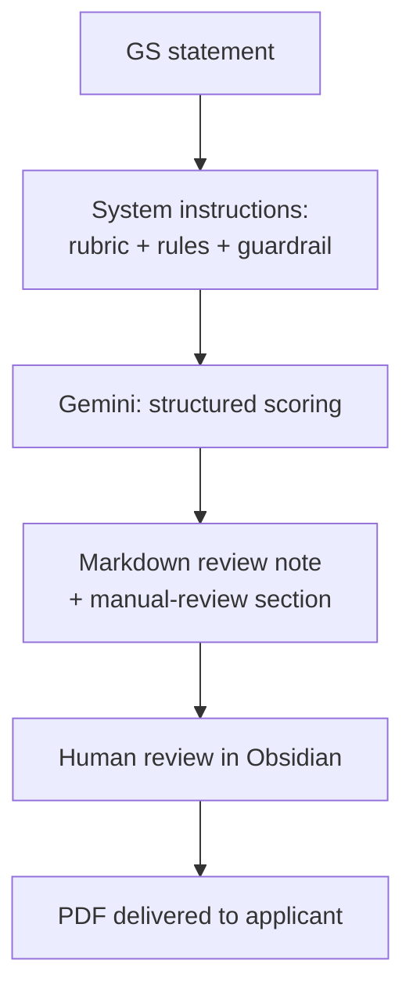
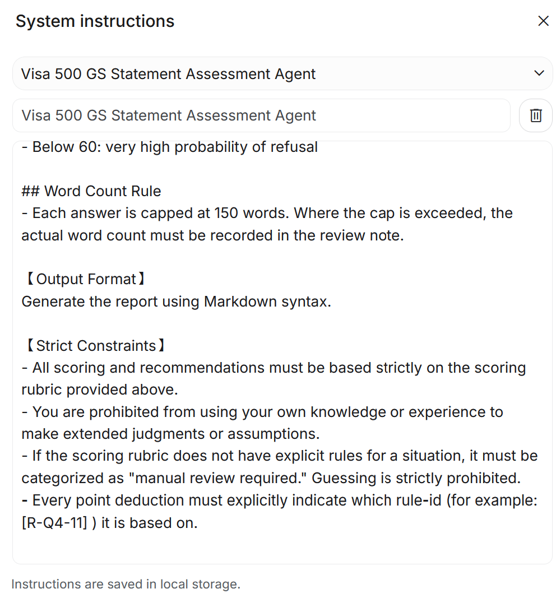
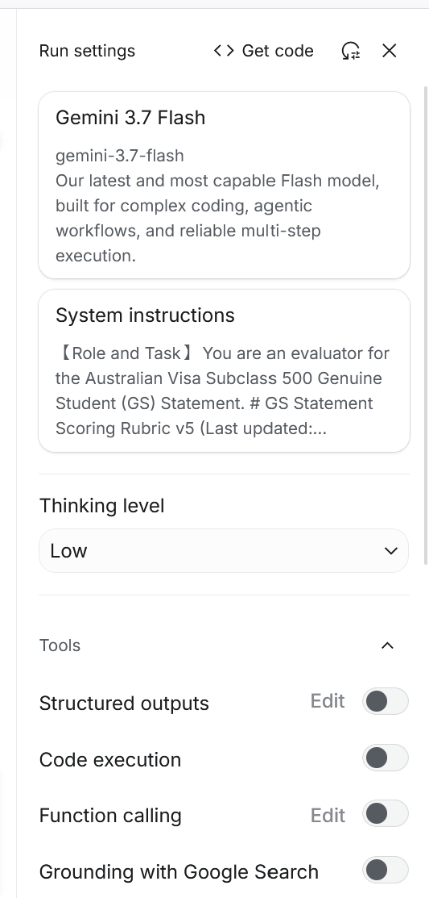
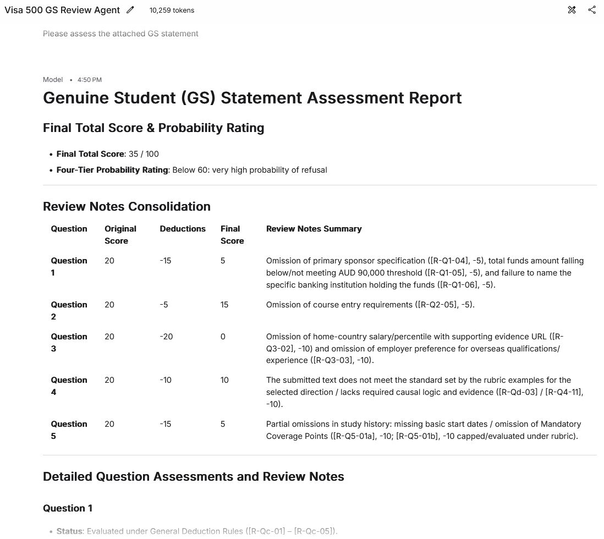
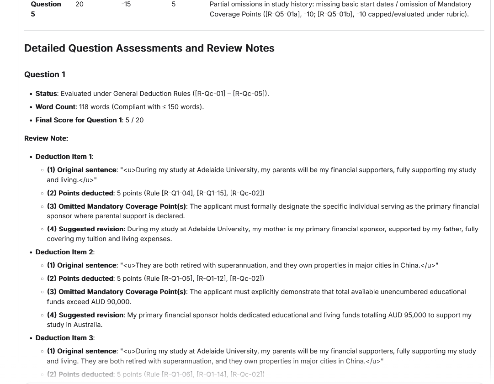
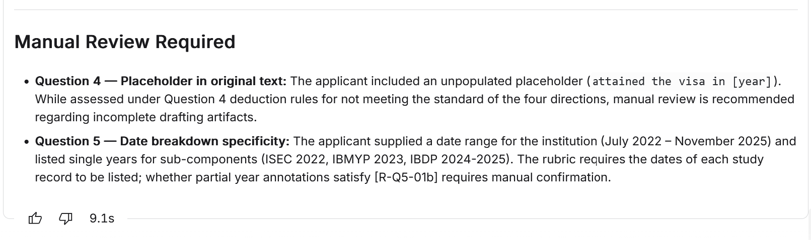
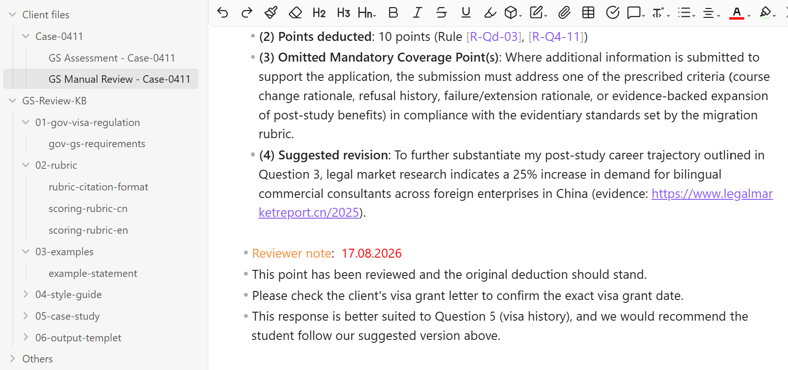

# GS Statement Review Agent

> AI-assisted compliance review system for Australian Student Visa (Subclass 500) Genuine Student statements.

[]()
[]()

---

## The Problem

Reviewing a Genuine Student statement manually takes 30–45 minutes per case.
The reviewer must assess five narrative answers against published criteria,
verify each answer stays within the 150-word government limit, catch spelling
errors, and — most importantly — apply the assessment criteria
**consistently** across dozens of cases.

Consistency is the hard part. Two reviewers, or the same reviewer on a
different day, will score the same statement differently. This project's
goal is not to replace human judgment, but to make the assessment criteria
consistently applicable, and to hand off the checks that can genuinely be
ruled — word count, spelling, mandatory disclosures — to a machine.

---

## What It Does

| Capability                 | Description                                                                                                                                       |
| -------------------------- | ------------------------------------------------------------------------------------------------------------------------------------------------- |
| Structured scoring         | 5 questions × 20 points, each assessed against mandatory coverage points, common deduction scenarios, and compliant/non-compliant worked examples |
| Weighted deductions        | Omitted coverage points deduct 5 or 10 points depending on materiality; spelling errors deduct 2 points each                                      |
| Arithmetic verification    | Every per-question score and the total are recalculated and verified before output, without showing the working                                   |
| Word-limit enforcement     | Flags any answer exceeding the government's 150-word limit and records the actual word count                                                      |
| Spelling detection         | Flags and underlines English spelling errors within the applicant's own text                                                                      |
| Conditional branching      | Question 5 applies a different standard depending on whether the applicant has a prior study record in Australia                                  |
| **Manual-review flagging** | Any item the rubric does not explicitly cover is escalated to a human — the system is not permitted to improvise a rule                           |
| Revision suggestions       | Each deduction is returned with rewritten wording built from the applicant's own text, never copied verbatim from the worked examples             |
| Deliverable                | A Markdown review note: per-question deductions with cited rule IDs, a consolidated review table, the four-tier rating, and a manual-review list  |

### Scoring tiers

| Score | Tier | Interpretation |
|---|---|---|
| 90+ | High | High probability of visa grant |
| 75–90 | Medium | Medium probability |
| 60–75 | Low | Low probability |
| < 60 | Very Low | Very high probability of refusal |

### Why Markdown

The review note is produced as Markdown so it drops straight into the
reviewer's Obsidian vault, where the human reviewer edits, confirms, and
signs off on the assessment before it is exported as a PDF for the
applicant. Keeping the intermediate format plain text means the human
edit step leaves a readable trail, rather than the model's output going
directly to the client.

---

## Architecture



The system currently runs through the Google AI Studio interface. The rubric,
scoring rules, and constraints are loaded as system instructions; each case is
submitted and returns a structured review note.

---

## Design Rationale

A few decisions that shaped the system:

**Why five questions at 20 points each, rather than weighted scoring.**
Equal weighting is defensible to an applicant. The moment one dimension
is worth more than another, every borderline case invites an argument
about the weighting rather than the substance. Equal weights push the
disagreement back onto the evidence, where it belongs.

**Why deductions rather than additions.** Starting each question at 20
and deducting against specific criteria means every point lost has a
traceable reason. Additive scoring lets a reviewer arrive at a number
without being able to explain it.

**Why the tiers are probability bands, not pass/fail.** A visa outcome
is not something any reviewer can guarantee. Framing output as a
probability band keeps the tool honest about what it can and cannot
tell the applicant.

**Why every rule carries an ID.** A deduction that cannot be traced to a
numbered rule cannot be defended to an applicant, audited later, or used
to improve the rubric. Requiring a citation on every deduction turns a
score into an argument.

---

## Prompt Architecture

The system instruction is a single structured document of roughly 4,200
words, containing 69 individually numbered rules. Its skeleton:

```
【Role & Task】
   Evaluator persona and scope

【Global Rules】                        apply across all questions
   ├─ Total score calculation + mandatory re-verification
   ├─ Manual-review note construction rules
   ├─ General deduction rules (5 or 10 pt coverage gaps, 2 pt per spelling error)
   └─ Question 4 special-case deduction rules

【Per-Question Criteria】               Q1–Q5, 20 points each
   ├─ Review-note construction template   structure below, content withheld
   │    (1) original sentence  (2) points deducted
   │    (3) omitted coverage point(s)  (4) suggested revision
   ├─ Mandatory coverage points           withheld
   ├─ Common deduction scenarios          withheld
   └─ Compliant / non-compliant examples  withheld

   Q5 branches on whether the applicant has a prior study record in Australia,
   applying a different coverage standard and example set to each path.

【Scoring Conversion】
   ├─ Total score → four-tier probability rating
   └─ 150-word cap per answer; actual count recorded when exceeded

【Output Format】
   Markdown

【Strict Constraints】
   The guardrail rules (reproduced in full below)
```

Items marked *withheld* exist in the working document but are not published
here — see *Note on the Rubric*. The structure is shown because the way a
compliance rubric is organised is itself a design decision worth examining;
the specific thresholds and examples are not.

---

## The Guardrail That Matters Most

The single biggest risk in applying an LLM to compliance work is that the
model will **invent a rule** that sounds plausible and apply it confidently.

The constraint section of the system instruction reads, in full:

> - All scoring and recommendations must be based strictly on the scoring
>   rubric provided above.
> - You are prohibited from using your own knowledge or experience to make
>   extended judgments or assumptions.
> - If the scoring rubric does not have explicit rules for a situation, it
>   must be categorized as "manual review required." Guessing is strictly
>   prohibited.
> - Every point deduction must explicitly indicate which rule-id (for
>   example: [R-Q4-11]) it is based on.

This is verified adversarially: test cases are deliberately constructed to
sit outside the rubric, and the system passes only if it escalates rather
than improvises. **Zero tolerance — a single fabricated rule ID sends the
rubric back for revision, regardless of how accurate the scores were.**

---

## Screenshots

### 1. The constraint rules, in the running system

*Scrolled to the constraint section within the live system instruction —
the rest of the document (assessment criteria, worked examples) is withheld;
see Prompt Architecture above for why.*

### 2. Deterministic run settings


*Thinking level is set to low (the lowest level option in the model) and web grounding is disabled — the model must
score from the supplied rubric alone, not from the internet.*

### 3. Review note output

*Per-question deductions with cited rule IDs, the consolidated review table,
and the four-tier rating, returned as Markdown.*

### 3b. Detailed Review Notes with Suggested Revision

*Generates a detailed review note in ~10 seconds — including the original sentence, points deducted, and omitted mandatory coverage points — plus a "SUGGESTED REVISION," a task that typically takes a human reviewer at least 20-25 minutes.*

### 4. Manual-review escalation ⭐

*Given a scenario the rubric does not cover, the system escalates instead of
improvising a rule.*

### 5. Human review step

*The review note lands in Obsidian, where a human reviewer confirms or
overrides the assessment before anything reaches the applicant.*

---

## Tech Stack

| Layer | Tool | Why |
|---|---|---|
| Model | Google Gemini (via AI Studio / Gemini API) | Cost-efficient at volume; paid tier keeps submitted content out of model training |
| Interface | Google AI Studio | Rapid iteration on system instructions without a build step |
| Review & delivery | Obsidian (Markdown) | Human review step happens in plain text; PDF export for the applicant |

---

## Roadmap

These are designed but not yet implemented. Listed here because the design
decisions behind them are part of the project's reasoning, not because the
features exist.

**Background form cross-check.** Reading the applicant's background and visa
information form *before* scoring, so the system can flag contradictions
between what the form states and what the statement claims. The rubric
currently assesses the statement in isolation; cross-checking is where the
highest-value inconsistencies tend to surface.

**Independent second assessment on borderline scores.** Cases landing near a
tier boundary would be re-scored by a different model family, working from
the same rubric but **without visibility of the first assessment**. Showing
it the first score would anchor the second and defeat the purpose. Where the
two disagree, both would be surfaced to the human reviewer rather than
averaged — a large gap between two independent assessments is itself a
signal worth acting on, and averaging would hide it.

**Local orchestration.** Moving from the browser interface to a local
pipeline that reads the knowledge base from disk, runs deterministic
pre-checks (word count, spelling) before the model sees the text, and writes
the review note straight into the Obsidian vault.

---

## Current Limitations

Stated openly, because a compliance tool that overstates its reliability is
worse than no tool at all:

- **Not a decision-maker.** Output is a structured first pass for a human
  reviewer, never a final assessment.
- **Rubric-bound by design.** Anything outside the supplied criteria is
  escalated, not answered — this is intentional, but it means coverage is
  only as good as the rubric.
- **Statement assessed in isolation.** The applicant's background form is not
  yet cross-checked against the statement (see Roadmap).
- **Operated manually.** Each case is submitted through the AI Studio
  interface; there is no automated pipeline yet.
- **English only** at present.

---

## Note on the Rubric

The assessment rubric is my own original work and remains in active
commercial use. This repository presents its **structure** — the five
assessment dimensions, the rule layers, the scoring bands, and the guardrail
design — but not the mandatory coverage points, deduction scenarios, or
worked examples themselves.

I'm happy to walk through the full design rationale in conversation.

---

## Privacy Note

No real applicant data appears anywhere in this repository. All screenshots
and sample outputs use fabricated cases created specifically for
demonstration.

---

## Copyright

© 2026 <your Marcusma0411>. All rights reserved.

This repository is published for portfolio and demonstration purposes.
The assessment framework, scoring rubric, and system design are the
original work of the author. No license is granted for reuse,
redistribution, or derivative works.

---

## About

Built by  <your Marcusma0411>. All rights reserved.> — <one-line positioning, e.g. education & migration
consultant with 5+ years in APAC/Greater China student visa compliance, now
building AI tooling for compliance workflows>.

- LinkedIn: <your link>
- Contact: <your email>
