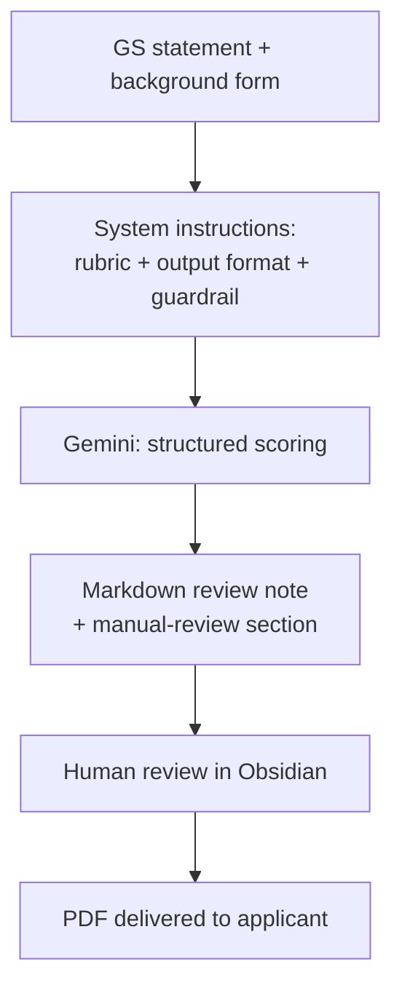

# visa500-gs-statement-review-agent
AI-assisted compliance review agent for Australian Visa Subclass 500's key document - Genuine Student statement 
# GS Statement Review Agent

> AI-assisted compliance review system for Australian Student Visa (Subclass 500) Genuine Student statements.
> 澳洲學生簽證 GS Statement 的 AI 輔助合規審查系統

[]()
[]()

---

## The Problem 問題背景

Reviewing a Genuine Student statement manually takes 30–45 minutes per case.
The reviewer must cross-check the applicant's background form against five
narrative answers, verify each answer stays within the 150-word government
limit, catch spelling errors, and — most importantly — apply the assessment
criteria **consistently** across dozens of cases.

Consistency is the hard part. Two reviewers, or the same reviewer on a
different day, will score the same statement differently.

**人工審查一份 GS statement 需要 30-45 分鐘**,且不同審查者、甚至同一人在不同
時間,對同一份文件的評分可能不一致。這個專案的目標不是取代人工判斷,而是
**讓評分標準可被一致地套用**,並把明顯可自動化的檢查(字數、拼字、背景一致性)
交給機器。

---

## What It Does 目前功能

| Capability | Description |
|---|---|
| Background cross-check | Reads the applicant's background/visa information form **before** scoring, then flags logical inconsistencies between background and stated answers |
| Structured scoring | 5 questions × 20 points, mapped to published assessment criteria |
| Word-limit enforcement | Flags any answer exceeding the government's 150-word limit |
| Spelling detection | Flags English spelling errors |
| **Manual-review flagging** | Any item the rubric does not explicitly cover is escalated to a human — the system is not permitted to improvise a rule |
| Deliverable | A Markdown review note containing the scores, the reasoning behind each deduction, and a dedicated manual-review section |

### Scoring tiers 評分分級

| Score | Tier | Interpretation |
|---|---|---|
| 90+ | High | High probability of approval |
| 75–90 | Medium | Moderate probability |
| 60–75 | Low | Low probability |
| < 60 | Very Low | Very high probability of refusal |

### Why Markdown 為什麼用 Markdown 輸出

The review note is produced as Markdown so it drops straight into the
reviewer's Obsidian vault, where the human reviewer edits, confirms, and
signs off on the assessment before it is exported as a PDF for the
applicant. Keeping the intermediate format plain text means the human
edit step leaves a readable trail, rather than the model's output going
directly to the client.

審查結果以 Markdown 輸出,可直接存進 Obsidian 由人工完成最後審閱與確認,
再匯出 PDF 交付給客戶。中間格式維持純文字,是為了讓人工修改的痕跡清楚可見
——模型的輸出不會直接送到客戶手上。

---

## Architecture 系統架構



The system currently runs through the Google AI Studio interface. The rubric,
output format, and constraint rules are loaded as system instructions; each
case is submitted and returns a structured review note.

目前透過 Google AI Studio 介面運行。評分細則、輸出格式與限制規則以 System
Instructions 載入,每份案件送出後回傳結構化的審查筆記。

---

## Design Rationale 設計思路

A few decisions that shaped the system:

**Why five questions at 20 points each, rather than weighted scoring.**
Equal weighting is defensible to an applicant. The moment one dimension
is worth more than another, every borderline case invites an argument
about the weighting rather than the substance. Equal weights push the
disagreement back onto the evidence, where it belongs.

**Why deductions rather than additions.** Starting each question at 20
and deducting against specific criteria means every point lost has a
traceable reason. Additive scoring lets a reviewer arrive at a number
without being able to explain it.

**Why the tiers are probability bands, not pass/fail.** A visa outcome
is not something any reviewer can guarantee. Framing output as a
probability band keeps the tool honest about what it can and cannot
tell the applicant.

---

## Prompt Architecture 提示詞架構

The system instruction is a single structured document of roughly
<X,XXX> words. Its skeleton:

```
【Role & Task】
   Reviewer persona, scope, and what the output is for

【Assessment Criteria】
   Q1–Q5, 20 points each
   ├─ Scoring dimensions per question
   ├─ Common deduction patterns          ← withheld
   ├─ Worked examples: passing answers   ← withheld
   └─ Worked examples: failing answers   ← withheld

【Output Format】
   Markdown review note template
   ├─ Per-question score + reasoning + rule_id
   ├─ Total score and tier
   └─ Manual-review section

【Constraints】
   The guardrail rules (reproduced in full below)
```

The criteria themselves are withheld — see *Note on the Rubric*. The
structure is shown because the way a compliance rubric is organised is
itself a design decision worth examining; the specific thresholds are not.

系統指令是一份約 <X,XXX> 字的結構化文件。上方為其骨架,標註 withheld 的
部分為未公開的評分細則本文。呈現架構而非內容,是因為「合規評分標準該
如何組織」本身就是一個值得討論的設計決策,具體門檻則不是。

---

## The Guardrail That Matters Most 最重要的一道防線

The single biggest risk in applying an LLM to compliance work is that the
model will **invent a rule** that sounds plausible and apply it confidently.

The system instruction contains an explicit constraint:

> All scoring must be based solely on the supplied assessment criteria.
> You may not apply your own knowledge or experience.
> If the criteria do not explicitly cover a situation, it must be listed
> under the manual-review section. Do not guess.
> Every deduction must cite the specific `rule_id` it is based on.

This is verified adversarially: test cases are deliberately constructed to
sit outside the rubric, and the system passes only if it escalates rather
than improvises. **Zero tolerance — a single fabricated `rule_id` sends the
rubric back for revision, regardless of how accurate the scores were.**

把 LLM 用在合規工作上,最大的風險是它會**編造一條聽起來很合理的規則**並自信地
套用。因此驗收標準是:刻意設計 rubric 未涵蓋的測試案例,系統必須誠實升級為
人工審查,而不是自行發明規則。**只要出現一次編造的 rule_id,不論分數多準,
一律退回修改 rubric。**

---

## Screenshots 操作展示

### 1. The constraint rules, in the running system

*Scrolled to the constraint section within the live system instruction —
the rest of the document (assessment criteria, worked examples) is withheld;
see Prompt Architecture above for why.*

### 1b. Prompt structure overview (optional)

*Collapsed outline view of the system instruction in Obsidian, showing scale
and structure without exposing any content.*

### 2. Deterministic run settings

*Temperature is set near zero and web grounding is disabled — the model must
score from the supplied rubric alone, not from the internet.*

### 3. Review note output

*Scores, per-question deductions, and the reasoning behind each, returned as
Markdown.*

### 4. Manual-review escalation ⭐

*Given a scenario the rubric does not cover, the system escalates instead of
improvising a rule.*

### 5. Human review step

*The review note lands in Obsidian, where a human reviewer confirms or
overrides the assessment before anything reaches the applicant.*

---

## Tech Stack 技術組成

| Layer | Tool | Why |
|---|---|---|
| Model | Google Gemini (via AI Studio / Gemini API) | Cost-efficient at volume; paid tier keeps submitted content out of model training |
| Interface | Google AI Studio | Rapid iteration on system instructions without a build step |
| Review & delivery | Obsidian (Markdown) | Human review step happens in plain text; PDF export for the applicant |

---

## Roadmap 後續規劃

These are designed but not yet implemented. Listed here because the design
decisions behind them are part of the project's reasoning, not because the
features exist.

**Independent second assessment on borderline scores.** Cases landing near a
tier boundary would be re-scored by a different model family, working from
the same rubric but **without visibility of the first assessment**. Showing
it the first score would anchor the second and defeat the purpose. Where the
two disagree, both would be surfaced to the human reviewer rather than
averaged — a large gap between two independent assessments is itself a
signal worth acting on, and averaging would hide it.

**臨界分數的獨立複核。**分數落在分級邊界附近的案件,由不同模型依同一份評分
細則重新評分,且**看不到第一次的評分結果**——若讓它看到,判斷會被錨定,獨立
複核就失去意義。兩者不一致時完整並列呈交人工判斷,不取平均:差距大這件事
本身就是值得注意的訊號,取平均會把它掩蓋掉。

**Local orchestration.** Moving from the browser interface to a local
pipeline that reads the knowledge base from disk, runs deterministic
pre-checks (word count, spelling) before the model sees the text, and writes
the review note straight into the Obsidian vault.

**本機自動化。**從瀏覽器介面轉為本機流程:直接讀取知識庫、在送進模型前先跑
確定性的前置檢查(字數、拼字),並將審查筆記直接寫入 Obsidian。

---

## Current Limitations 目前限制

Stated openly, because a compliance tool that overstates its reliability is
worse than no tool at all:

- **Not a decision-maker.** Output is a structured first pass for a human
  reviewer, never a final assessment.
- **Rubric-bound by design.** Anything outside the supplied criteria is
  escalated, not answered — this is intentional, but it means coverage is
  only as good as the rubric.
- **Operated manually.** Each case is submitted through the AI Studio
  interface; there is no automated pipeline yet.
- **Validated on a small sample** of historical cases to date.
- **English only** at present.

---

## Note on the Rubric 關於評分細則

The assessment rubric is my own original work and remains in active
commercial use. This repository presents its **structure** — the five
assessment dimensions, the scoring bands, and the guardrail design —
but not the detailed criteria, deduction patterns, or worked examples
themselves.

I'm happy to walk through the full design rationale in conversation.

評分細則為本人原創、且仍在實際業務中使用,因此本儲存庫僅呈現其**架構**
(五個評估維度、分數區間、防呆機制設計),不含細則本文、扣分模式或範例內容。
細節設計思路歡迎面談時交流。

---

## Privacy Note 資料使用聲明

No real applicant data appears anywhere in this repository. All screenshots
and sample outputs use fabricated cases created specifically for
demonstration.

**本儲存庫不含任何真實申請人資料。**所有截圖與範例輸出皆使用專為展示而虛構的
案例。

---

## Copyright

© 2026 <你的名字>. All rights reserved.

This repository is published for portfolio and demonstration purposes.
The assessment framework, scoring rubric, and system design are the
original work of the author. No license is granted for reuse,
redistribution, or derivative works.

本儲存庫僅供作品展示。評分架構、評分細則與系統設計皆為作者原創,
不授予任何重製、散布或改作之權利。

---

## About 關於

Built by <你的名字> — <一句話定位,例如:education & migration consultant
with 5+ years in APAC/Greater China student visa compliance, now building
AI tooling for compliance workflows>.

- LinkedIn: <你的連結>
- Contact: <你的 email>
